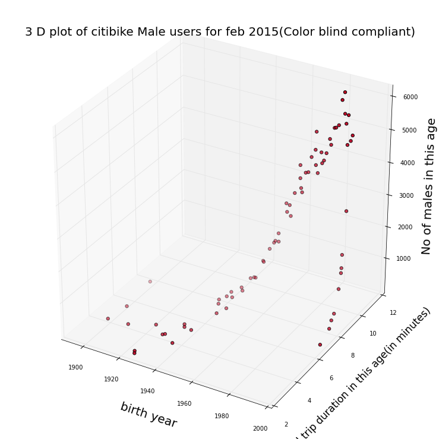
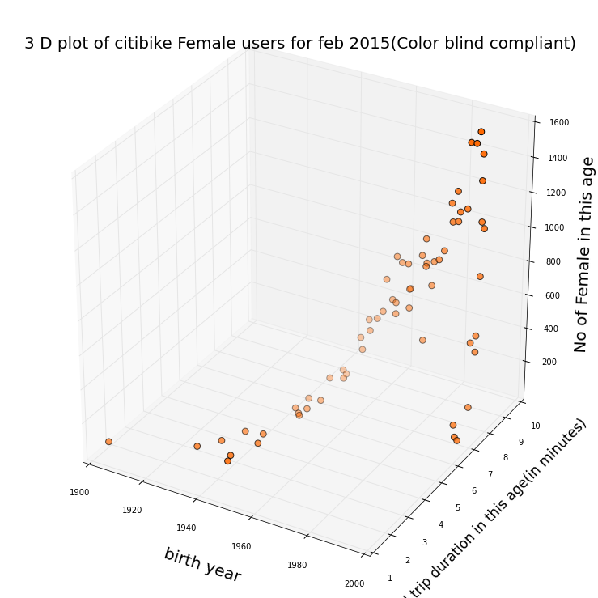

Review Target: wh937	winnielucky 

CLARITY: I could not say the plot is easy to read because there is a serious problem that I cannot tell how high the points are. In other words. readers could not know where the points exactly are in this 3D space. 

ESTHETICS: The color is not that easy to read as well although it considerate that the plot is color blind compliant. I cannot exactly tell the degree of deepth represent because it seems not fit any axis.

HONESTY: I think the plot is honest and the problem is only in how to show it. 

SUGGESTIONS: I think the best way to improve is add spatial reference in the 3D plot or change it to 2D. Besides, the color could be changed to fit z axis and the size of point could be little bigger. In addition, the 'NO' in z-axis title shoud be changed into 'NO.'.

