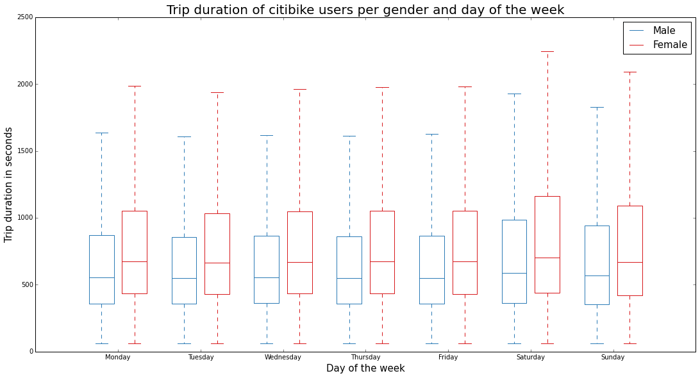

Review Target: dm3805	diogomiura 

CLARITY: The plot is totally easy to read. The x-axis and y-axis is clear as well as the unit of them. A little suggestion is that if the unit of y-axis could be minutes instead of seconds the plot would be more easy to read.

ESTHETICS: The color is appropriate here. There are only two colo -bule for male and red for female. 

HONESTY: The plot honestly reproducing the data I would say. However, the weekdays data are really similar in the plot, I can't tell the difference from them. If the y-axis could be changed into more detail range, would it be more clear? 

SUGGESTIONS: A little suggestion is that if the unit of y-axis could be minutes instead of seconds the plot would be more easy to read.

